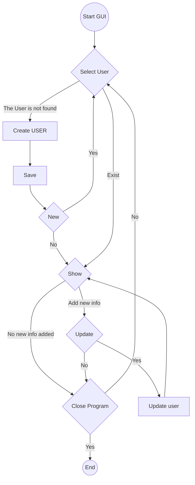

```mermaid
flowchart TD
    A((Start GUI)) -->B
    B{Select User}
    B -->|The User is not found|C[Create USER]
    C-->E[Save]
    E-->F{New}
    F-->|Yes|B
    F-->|No|D
    B -->|Exist|D{Show}
    D-->|No new info added|J
    D-->|Add new info|H{Update}
    H-->|Yes|K[Update user]
    K-->D
    H-->|No|J{Close Program}
    J-->|No|B
    J-->|Yes|I((End))

```

